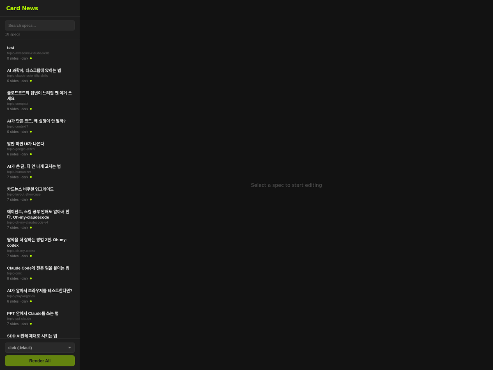
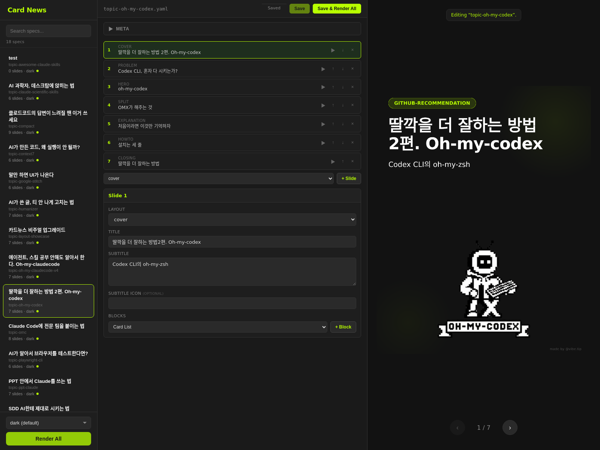
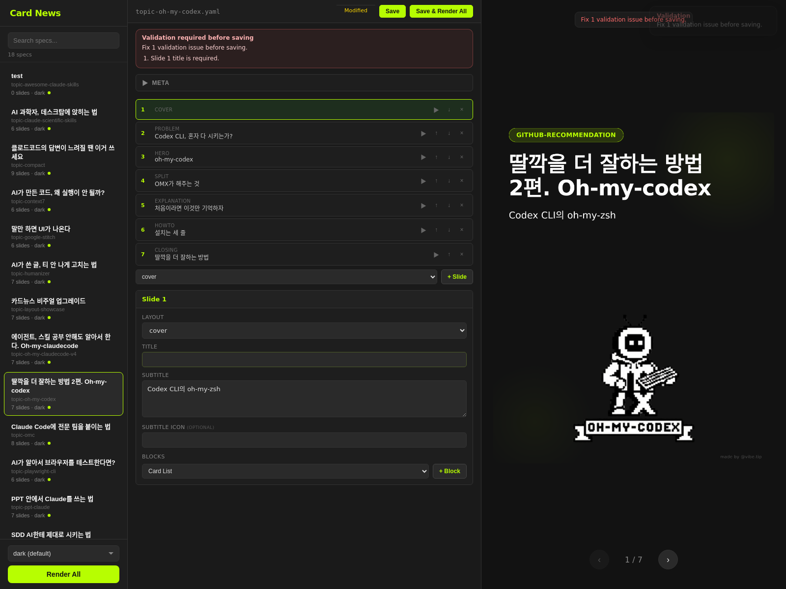
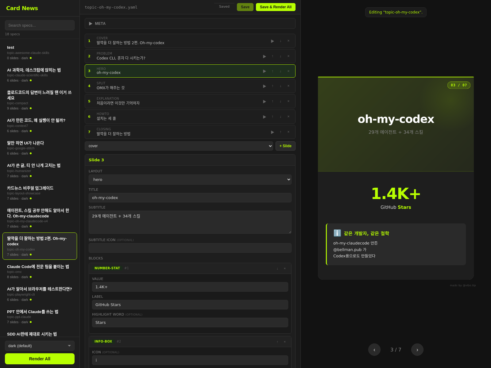

# cardnews-studio

YAML 파일 하나로 인스타그램/SNS용 카드뉴스 이미지를 만들어주는 도구입니다.
웹 에디터에서 내용을 수정하고, 버튼 하나로 PNG 이미지를 뽑아낼 수 있습니다.

<p align="center">
  
</p>

## 이런 분들에게 유용합니다

- SNS 카드뉴스를 자주 만드는 마케터, 콘텐츠 크리에이터
- 디자인 툴 없이 빠르게 카드뉴스를 만들고 싶은 분
- 반복되는 카드뉴스 제작을 자동화하고 싶은 팀

## 어떻게 동작하나요?

1. YAML 파일에 제목, 슬라이드 내용, 블록 등을 작성합니다
2. 웹 에디터에서 실시간으로 수정하고 미리보기를 확인합니다
3. **Render** 버튼을 누르면 슬라이드별 PNG 이미지가 생성됩니다

별도의 디자인 작업 없이, 텍스트만 준비하면 됩니다.

## 주요 기능

### 웹 에디터

브라우저에서 바로 사용할 수 있는 에디터입니다. 슬라이드를 추가/삭제하고, 블록을 끌어서 순서를 바꾸고, 저장하면 바로 PNG로 렌더링됩니다.

<p>
  
</p>

### 16가지 블록 타입

카드 리스트, 코드 에디터, 터미널, 인용문, 표, 통계 숫자, 진행 바, 단계 리스트 등 다양한 블록을 조합해서 슬라이드를 구성할 수 있습니다.

### 저장 전 자동 검증

저장하기 전에 필수 항목 누락, 형식 오류 등을 자동으로 체크합니다. 문제가 있으면 어디를 고쳐야 하는지 알려줍니다.

<p>
  
</p>

### 슬라이드-프리뷰 동기화

왼쪽에서 슬라이드 카드를 클릭하면, 오른쪽 미리보기가 해당 슬라이드로 자동 이동합니다.

<p>
  
</p>

### 테마

기본 테마 외에 8bit, warm 등 테마를 적용할 수 있으며, 직접 테마를 추가할 수도 있습니다.

### AI 커버 일러스트 (선택)

Gemini API 키가 있으면 커버 슬라이드용 일러스트를 AI로 자동 생성할 수 있습니다.

## 시작하기

### 1. 설치

```bash
git clone https://github.com/devswha/cardnews-studio.git
cd cardnews-studio
npm install
```

### 2. 웹 에디터 실행

```bash
npm start
```

브라우저에서 `http://localhost:3456` 을 열면 에디터가 나타납니다.

포트를 바꾸고 싶다면:

```bash
PORT=4567 npm start
```

### 3. CLI로 렌더링 (선택)

웹 에디터 없이 터미널에서 직접 렌더링할 수도 있습니다.

```bash
node render.js examples/hello.yaml              # 전체 슬라이드
node render.js examples/hello.yaml --slide 3    # 3번 슬라이드만
node render.js examples/hello.yaml --theme warm # 테마 적용
```

결과물은 `output/` 폴더에 PNG 파일로 저장됩니다.

### 4. AI 커버 일러스트 설정 (선택)

`.env` 파일을 만들고 Gemini API 키를 넣으면 커버 일러스트를 자동 생성할 수 있습니다.

```bash
cp .env.example .env
# .env 파일을 열고 GEMINI_API_KEY를 입력하세요
```

## YAML 스펙 예시

```yaml
meta:
  title: 나만의 카드뉴스 제목
  subtitle: 부제목을 여기에
  author: 홍길동
  total_slides: 3

slides:
  - slide: 1
    layout: cover
    title: 첫 번째 슬라이드
    subtitle: 표지입니다

  - slide: 2
    layout: content
    title: 핵심 내용
    blocks:
      - type: card-list
        items:
          - emoji: "1"
            title: 첫 번째 포인트
            description: 설명을 여기에 작성합니다
          - emoji: "2"
            title: 두 번째 포인트
            description: 설명을 여기에 작성합니다

  - slide: 3
    layout: closing
    title: 감사합니다
    blocks: []
```

## Claude Code 스킬

[Claude Code](https://claude.ai/claude-code) 사용자라면, 스킬을 설치해서 텍스트나 마크다운을 넘기면 카드뉴스를 자동 생성할 수 있습니다.

```bash
mkdir -p ~/.claude/skills/cardnews
cp SKILL.md ~/.claude/skills/cardnews/
```

사용법:

```
/cardnews

아래 내용으로 카드뉴스를 만들어줘:
[마크다운 또는 텍스트 붙여넣기]
```

## 프로젝트 구조

```text
cardnews-studio/
├── render.js          # CLI 렌더러
├── server.js          # 웹 에디터 서버
├── CLAUDE.md          # Claude Code 프로젝트 가이드
├── SKILL.md           # Claude Code 스킬
├── examples/          # 예제 YAML 스펙
├── public/            # 에디터 프론트엔드
├── src/               # 핵심 로직 (파서, 렌더러, 블록)
├── styles/            # CSS 테마
├── templates/         # Handlebars 템플릿
└── test/              # 테스트
```

## 테스트

```bash
npm test
```

## License

[MIT](LICENSE)
